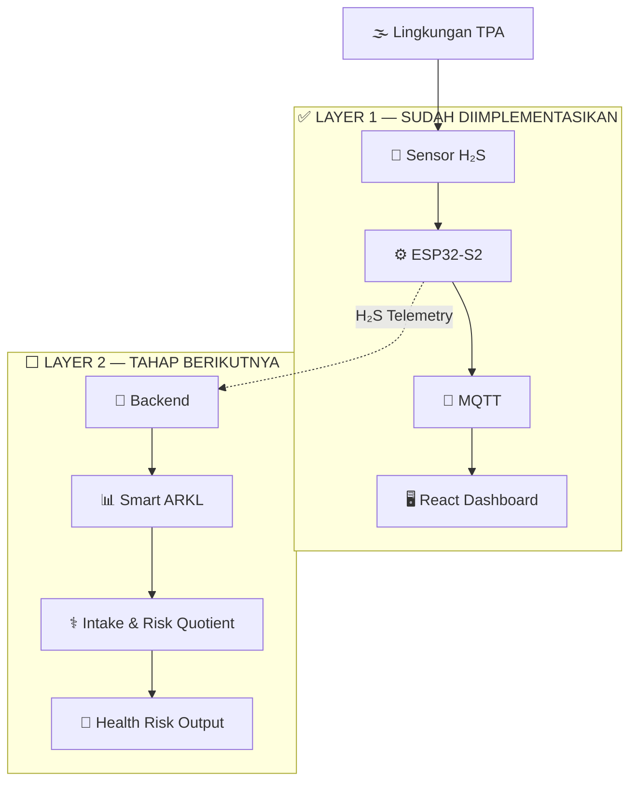
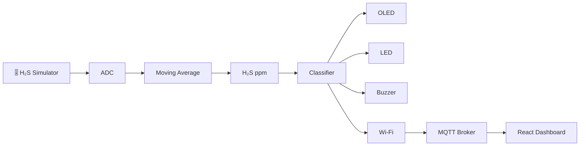
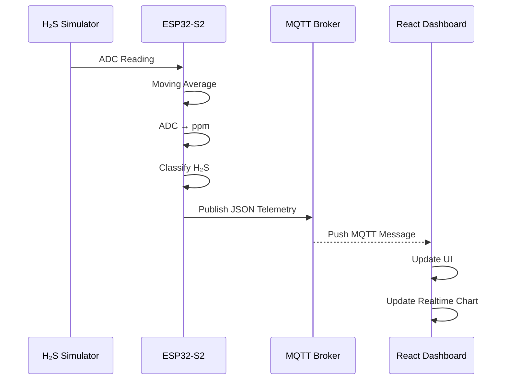
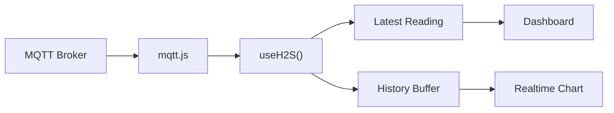
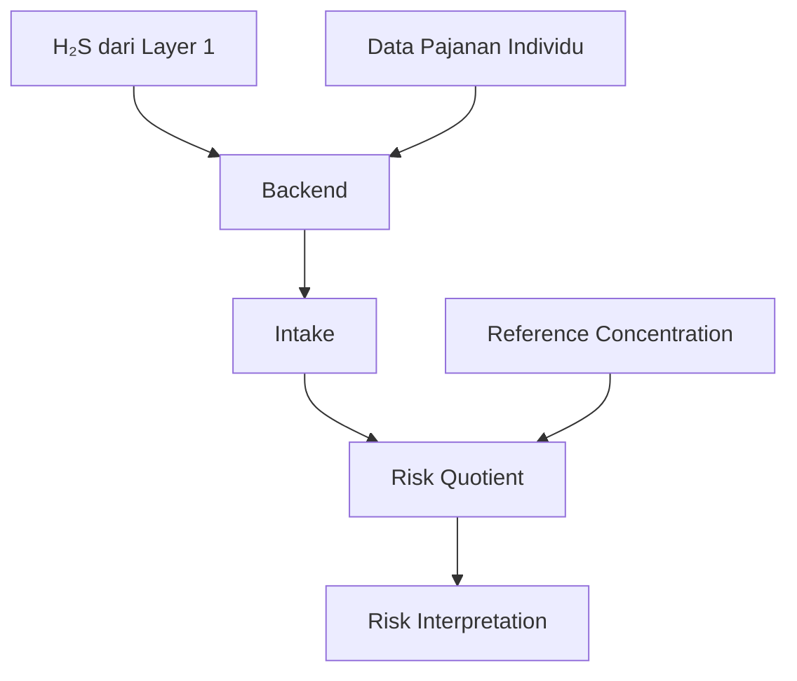

# ☁️ Smart H₂S Intelligent Monitor

> **Layer 1 — Environmental IoT Monitoring System**
> Real-time Hydrogen Sulfide (H₂S) monitoring prototype using **ESP32-S2 + Wokwi + MQTT + React Dashboard**.

<p align="center">


</p>

---

## 📌 Development Checkpoint

**Current development position:**

```text
LAYER 1 — ENVIRONMENTAL IoT MONITORING
STATUS: ✅ PROOF OF CONCEPT BERHASIL

LAYER 2 — SMART ARKL / HEALTH RISK ENGINE
STATUS: ⬜ BELUM DIIMPLEMENTASIKAN
```

Layer 1 telah berhasil diuji secara **end-to-end**:

```text
Wokwi
  ↓
ESP32-S2
  ↓
ADC + Filtering
  ↓
H₂S ppm
  ↓
Concentration Classification
  ↓
OLED + LED + Buzzer
  ↓
Wi-Fi
  ↓
MQTT
  ↓
React Dashboard
  ↓
Realtime Visualization
```

> [!IMPORTANT]
> Sistem pada tahap ini adalah **Layer 1**.
> Sistem hanya memonitor dan menginterpretasikan **konsentrasi H₂S di lingkungan**.
>
> Sistem **belum melakukan Analisis Risiko Kesehatan Lingkungan (ARKL), menghitung Intake, Risk Quotient (RQ), maupun mendiagnosis ISPA.**

---

# 🎯 Tujuan Layer 1

Layer 1 dikembangkan untuk menjawab satu pertanyaan utama:

> **“Berapa konsentrasi H₂S di lingkungan pada saat ini, dan pada tingkat konsentrasi tersebut kondisi lingkungan berada pada kategori apa?”**

Tanggung jawab Layer 1:

* membaca data sensor H₂S;
* melakukan filtering terhadap pembacaan sensor;
* mengubah pembacaan menjadi konsentrasi `ppm`;
* mengklasifikasikan konsentrasi H₂S;
* memberikan indikator lokal melalui OLED, LED, dan buzzer;
* mengirim telemetry menggunakan MQTT;
* menampilkan kondisi H₂S secara realtime pada dashboard web.

---

# 🧠 Konsep Sistem Keseluruhan

Penelitian dirancang memiliki **dua layer utama**.



---

# ✅ Layer 1 — Environmental Monitoring

## Mekanisme



Secara sederhana:

```text
H₂S
 ↓
Sensor
 ↓
ESP32-S2
 ↓
ADC
 ↓
Moving Average Filter
 ↓
ppm
 ↓
Concentration Classifier
 ↓
┌─────────────┬──────────────┐
│             │              │
▼             ▼              ▼
Local       MQTT         Dashboard
Alarm        │
             ▼
         React Web
```

---

# 🧪 Status Sensor Saat Ini

Pada fase pengembangan Wokwi, **sensor H₂S fisik belum digunakan**.

Sebagai gantinya digunakan:

```text
Potentiometer
      ↓
ADC ESP32-S2
      ↓
0 – 4095
      ↓
Simulated H₂S
      ↓
0 – 1000 ppm
```

Potentiometer memungkinkan pengujian seluruh skenario konsentrasi secara aman di lingkungan simulasi.

> [!WARNING]
> Nilai `ppm` pada Wokwi merupakan **SIMULATED H₂S VALUE**.
>
> Nilai tersebut **bukan hasil kalibrasi sensor H₂S nyata** dan tidak boleh dianggap sebagai hasil pengukuran lingkungan sebenarnya.

Ketika prototype hardware fisik dikembangkan:

```text
Wokwi Potentiometer
        ↓
akan diganti
        ↓
Real H₂S Sensor
        ↓
Calibration
        ↓
Measured H₂S Concentration
```

---

# 🔌 Hardware Simulation

Layer 1 saat ini menggunakan:

| Komponen            | Fungsi                 |
| ------------------- | ---------------------- |
| ESP32-S2 DevKitM-1  | Controller utama       |
| Potentiometer       | Simulator sensor H₂S   |
| SSD1306 OLED 128×64 | Tampilan lokal         |
| Green LED           | Indikator level rendah |
| Yellow LED          | Indikator waspada      |
| Red LED             | Indikator bahaya       |
| Buzzer              | Alarm lokal            |
| Wi-Fi ESP32         | Komunikasi jaringan    |
| MQTT                | Pengiriman telemetry   |

---

# 🔧 Pin Mapping

| Device                            |  ESP32-S2 |
| --------------------------------- | --------: |
| H₂S Simulator / Potentiometer SIG |  `GPIO 4` |
| OLED SDA                          |  `GPIO 8` |
| OLED SCL                          |  `GPIO 9` |
| Green LED                         | `GPIO 39` |
| Yellow LED                        | `GPIO 40` |
| Red LED                           | `GPIO 41` |
| Buzzer                            | `GPIO 42` |

```text
                    ESP32-S2
               ┌─────────────────┐
H₂S Simulator ─► GPIO 4          │
               │                 │
OLED SDA ◄─────┤ GPIO 8          │
OLED SCL ◄─────┤ GPIO 9          │
               │                 │
Green LED ◄────┤ GPIO 39         │
Yellow LED ◄───┤ GPIO 40         │
Red LED ◄──────┤ GPIO 41         │
Buzzer ◄───────┤ GPIO 42         │
               └─────────────────┘
```

---

# 📊 Pemrosesan Data Sensor

Raw ADC tidak langsung dikirim ke dashboard.

Pipeline:

```text
RAW ADC
   ↓
Moving Average Filter
   ↓
Filtered ADC
   ↓
ADC → ppm Mapping
   ↓
H₂S Concentration
   ↓
Classification
```

Moving Average digunakan untuk mengurangi perubahan pembacaan yang terlalu cepat/noisy.

Contoh telemetry:

```json
{
  "device_id": "H2S-TPA-001",
  "ppm": 219.05,
  "adc": 897,
  "filtered_adc": 897.0,
  "level": 6,
  "status": "BAHAYA BERAT",
  "effect": "Iritasi berat mata dan tenggorokan.",
  "uptime_ms": 162000,
  "simulated": true
}
```

---

# 📡 IoT Communication

Komunikasi Layer 1 menggunakan **MQTT**.



### MQTT Topic

```text
afyuadri/h2s-demo/a7c91f/device-001/telemetry
```

### Publish Interval

```text
1 second
```

Data dari Wokwi tidak dikirim langsung ke `localhost`.

Arsitektur yang digunakan:

```text
Wokwi ESP32
      │
      │ MQTT TCP
      ▼
MQTT Broker
      │
      │ MQTT WebSocket
      ▼
React Browser
```

---

# 🖥️ Frontend Dashboard

Frontend Layer 1 menggunakan:

```text
React
+
Vite
+
Tailwind CSS
+
MQTT.js
```

Dashboard menampilkan:

* konsentrasi H₂S realtime;
* status konsentrasi;
* efek berdasarkan reference table;
* filtered ADC;
* raw ADC;
* device uptime;
* connection status;
* rolling data buffer;
* grafik H₂S realtime;
* garis referensi konsentrasi.

---

## Dashboard Data Flow



---

# 🌐 Frontend Structure

Struktur dibuat sederhana karena dikembangkan sebagai **solo developer project**.

```text
src/
│
├── components/
│   ├── MetricCard.jsx
│   └── H2SChart.jsx
│
├── hooks/
│   └── useH2S.js
│
├── lib/
│   └── mqtt.js
│
├── App.jsx
├── main.jsx
└── index.css
```

Tidak menggunakan arsitektur frontend yang terlalu kompleks pada Layer 1.

---

# ⚠️ H₂S Concentration References

Layer 1 menggunakan **dua kelompok referensi yang harus dibedakan**:

1. **Efek H₂S berdasarkan konsentrasi**
2. **Occupational exposure / emergency limits**

Keduanya tidak mempunyai fungsi yang sama.

---

# 🧪 1. Efek H₂S Berdasarkan Konsentrasi

Tabel berikut berasal dari artikel:

> Shinta Herlianty & Kania Dewi.
> *Potensi Gangguan Bau Gas Hidrogen Sulfida (H₂S) di Lingkungan Kerja PT Pertamina (Persero) RU IV Cilacap.*
> Jurnal Teknik Lingkungan, Vol. 19 No. 2, 2013.

Artikel tersebut menyajikan tabel **“Efek H₂S terhadap manusia sesuai tingkatan konsentrasinya”** dengan rujukan **ANSI, 1978**.

|             H₂S | Efek yang dicantumkan                                         |
| --------------: | ------------------------------------------------------------- |
|    **0,13 ppm** | Bau minimal yang masih terasa                                 |
|     **4,6 ppm** | Mudah dideteksi, bau sedang                                   |
|      **10 ppm** | Permulaan iritasi mata dan mulai berair                       |
|      **27 ppm** | Bau tidak enak dan tidak dapat ditoleransi lagi               |
|     **100 ppm** | Batuk, iritasi mata, indera penciuman tidak berfungsi         |
| **200–300 ppm** | Pembengkakan mata dan kekeringan di kerongkongan              |
| **500–700 ppm** | Kehilangan kesadaran dan dapat mematikan dalam 30 menit–1 jam |
|    **>700 ppm** | Kehilangan kesadaran dengan cepat dan berlanjut ke kematian   |

### Source

https://journals.itb.ac.id/index.php/jtl/article/download/8320/3346

---

# 🦺 2. NIOSH / OSHA Safety References

CDC — NIOSH Pocket Guide mencantumkan:

| Reference             |                 Konsentrasi |
| --------------------- | --------------------------: |
| **NIOSH REL**         | `10 ppm ceiling / 10 menit` |
| **OSHA PEL Ceiling**  |                    `20 ppm` |
| **OSHA Maximum Peak** |         `50 ppm / 10 menit` |
| **NIOSH IDLH**        |                   `100 ppm` |

`IDLH`:

> **Immediately Dangerous to Life or Health**

### Source

https://www.cdc.gov/niosh/npg/npgd0337.html

---

# 👃 Mengapa Sensor Tetap Dibutuhkan Jika H₂S Berbau?

H₂S dikenal memiliki karakteristik bau seperti telur busuk.

Namun CDC/NIOSH menjelaskan bahwa kemampuan indera penciuman terhadap H₂S dapat mengalami **rapid fatigue**.

Artinya:

```text
H₂S ada
 ↓
bau mungkin tercium
 ↓
indra penciuman mengalami fatigue
 ↓
bau tidak lagi menjadi indikator yang dapat diandalkan
```

Karena itu:

> **Indera penciuman manusia tidak boleh dijadikan satu-satunya sistem peringatan terhadap keberadaan H₂S secara terus-menerus.**

Hal ini menjadi salah satu alasan penting penggunaan:

```text
Sensor
+
Continuous Monitoring
+
Realtime Dashboard
+
Alarm
```

---

# 🚦 Application Classification

> [!NOTE]
> Kategori berikut adalah **logika aplikasi Layer 1 yang menggabungkan titik referensi dari sumber penelitian dan occupational-safety references**.
>
> Nama kategori seperti `WARNING`, `DANGER`, atau `CRITICAL` merupakan label sistem untuk mempermudah interpretasi dashboard dan **bukan klasifikasi klinis baru**.

|     Range H₂S | Application Status     | Reference Context                         |
| ------------: | ---------------------- | ----------------------------------------- |
|   `<0,13 ppm` | 🟢 `NORMAL`            | Di bawah odor threshold pada tabel        |
| `0,13 – <4,6` | 🟢 `BAU TERDETEKSI`    | Bau mulai terasa                          |
|   `4,6 – <10` | 🟡 `WASPADA`           | Bau mudah dideteksi                       |
|    `10 – <20` | 🟡 `IRITASI / WARNING` | Efek mata pada tabel + NIOSH REL          |
|    `20 – <27` | 🔴 `DANGER`            | OSHA ceiling telah dicapai/dilampaui      |
|    `27 – <50` | 🔴 `DANGER`            | Bau tidak dapat ditoleransi               |
|   `50 – <100` | 🔴 `SEVERE DANGER`     | OSHA maximum peak reference               |
|  `100 – <200` | 🚨 `EMERGENCY / IDLH`  | NIOSH IDLH = 100 ppm                      |
|   `200 – 300` | 🚨 `EXTREME DANGER`    | Efek berat mata/tenggorokan pada tabel    |
| `>300 – <500` | 🚨 `EXTREME DANGER`    | Tidak ada efek spesifik pada tabel sumber |
|   `500 – 700` | ☠️ `CRITICAL`          | Kehilangan kesadaran / dapat fatal        |
|        `>700` | ☠️ `LETHAL EMERGENCY`  | Kehilangan kesadaran cepat / kematian     |

---

## ⚠️ Gap pada 300–500 ppm

Sumber tabel yang digunakan tidak mencantumkan efek khusus untuk interval:

```text
>300 ppm
sampai
<500 ppm
```

Karena itu sistem **tidak mengarang efek kesehatan baru untuk rentang tersebut**.

Pada implementasi aplikasi, rentang ini tetap diperlakukan sebagai kondisi sangat berbahaya karena:

```text
300 ppm
   ↑
sudah jauh melewati
NIOSH IDLH 100 ppm
```

Namun efek fisiologis spesifik untuk rentang tersebut **tidak diklaim berasal dari tabel ITB/ANSI**.

---

# 🚨 Alarm Logic

Layer 1 memiliki local warning melalui LED dan buzzer.

```text
Low concentration
      ↓
🟢 Green

Increasing concentration
      ↓
🟡 Yellow

Dangerous concentration
      ↓
🔴 Red

Extreme concentration
      ↓
🔴 Blinking Red
+
🔊 Buzzer
```

Alarm lokal tetap dapat bekerja meskipun:

```text
Wi-Fi ❌
MQTT ❌
Dashboard ❌
```

karena klasifikasi dilakukan langsung pada ESP32-S2.

Ini menjaga fungsi dasar monitoring tidak bergantung sepenuhnya pada koneksi jaringan.

---

# 🔄 Realtime Monitoring Mechanism

Setiap siklus:

```text
1. Read ADC
      ↓
2. Update moving-average buffer
      ↓
3. Generate filtered ADC
      ↓
4. Convert to simulated ppm
      ↓
5. Determine concentration class
      ↓
6. Update LED
      ↓
7. Update buzzer
      ↓
8. Update OLED
      ↓
9. Publish MQTT telemetry
      ↓
10. React receives MQTT message
      ↓
11. Dashboard updates
      ↓
12. Chart appends reading
```

---

# 🧾 Telemetry Contract

ESP32 mengirim data dalam JSON.

<details>

<summary><b>📦 Lihat contoh MQTT Payload</b></summary>

```json
{
  "device_id": "H2S-TPA-001",
  "ppm": 219.05,
  "adc": 897,
  "filtered_adc": 897.0,
  "level": 6,
  "status": "BAHAYA BERAT",
  "effect": "Iritasi berat mata dan tenggorokan.",
  "uptime_ms": 162000,
  "simulated": true
}
```

</details>

---

# 🗃️ Realtime Buffer

Frontend menyimpan rolling history:

```text
60 readings
```

Dengan publish interval:

```text
1 reading / second
```

maka chart saat ini kurang lebih merepresentasikan:

```text
±60 detik data terbaru
```

Buffer ini hanya berada pada frontend pada Layer 1.

Belum ada persistent database.

Jika browser direfresh:

```text
history
↓
reset
```

Persistent historical data akan menjadi tanggung jawab backend pada tahap berikutnya.

---

# 🖥️ Dashboard Prototype

Dashboard realtime yang telah berhasil diuji menampilkan:

```text
┌───────────────────────────────────────┐
│ H₂S Intelligent Monitor              │
│                        ● Live MQTT    │
├───────────────────────────────────────┤
│                                       │
│ LIVE CONCENTRATION                    │
│                                       │
│          219.05 PPM                   │
│                                       │
│          BAHAYA BERAT                 │
│                                       │
│ Iritasi berat mata dan tenggorokan.   │
│                                       │
├────────────┬────────────┬─────────────┤
│ ADC Fil.   │ Uptime     │ Buffer      │
│ 897        │ 2m 42s     │ 60/60       │
├────────────┴────────────┴─────────────┤
│                                       │
│          Tren Realtime                │
│                                       │
│              📈                       │
│                                       │
└───────────────────────────────────────┘
```

---

# 🧪 Testing Status

<details open>

<summary><b>✅ Layer 1 Test Checklist</b></summary>

* [x] ESP32-S2 berjalan di Wokwi
* [x] Potentiometer dapat mensimulasikan perubahan H₂S
* [x] Raw ADC terbaca
* [x] Moving-average filtering bekerja
* [x] ADC dapat dipetakan menjadi simulated ppm
* [x] H₂S concentration classifier bekerja
* [x] OLED menampilkan nilai realtime
* [x] Green LED bekerja
* [x] Yellow LED bekerja
* [x] Red LED bekerja
* [x] Buzzer bekerja
* [x] Wi-Fi `Wokwi-GUEST` berhasil tersambung
* [x] MQTT broker berhasil tersambung
* [x] ESP32 berhasil publish telemetry
* [x] React berhasil subscribe MQTT
* [x] Data dummy frontend telah diganti data realtime
* [x] Current H₂S berubah tanpa refresh browser
* [x] Status berubah mengikuti data Wokwi
* [x] Realtime chart bekerja
* [x] Rolling buffer bekerja
* [x] Device uptime ditampilkan
* [x] Proof-of-concept Layer 1 berhasil end-to-end

</details>

---

# ✅ Current Project State

```text
                     PROJECT STATUS

LAYER 1
Environmental IoT Monitoring
██████████████████████████████  ✅ PoC COMPLETE


LAYER 2
Smart ARKL
░░░░░░░░░░░░░░░░░░░░░░░░░░░░  ⬜ NOT STARTED
```

---

# 🧩 Apa yang Belum Termasuk Layer 1?

Layer 1 **tidak menghitung**:

* berat badan pengguna;
* durasi kerja;
* frekuensi pajanan;
* laju inhalasi;
* Intake;
* Reference Concentration untuk perhitungan ARKL;
* Risk Quotient;
* risiko lifetime;
* profil pemulung;
* diagnosis penyakit;
* probabilitas ISPA.

Semua komponen tersebut akan ditempatkan pada:

```text
LAYER 2
SMART ARKL
```

---

# 🧠 Layer 2 — Next Architecture

Layer berikutnya direncanakan:



Data yang akan digunakan antara lain:

```text
H₂S concentration
+
berat badan
+
durasi pajanan
+
frekuensi pajanan
+
laju inhalasi
+
parameter ARKL
        ↓
Intake
        ↓
RQ
        ↓
Health Risk Interpretation
```

> Layer 2 **belum diimplementasikan pada checkpoint README ini**.

---

# 🗺️ Development Roadmap

```text
PHASE 01
Layer 1 Hardware Simulation
✅ COMPLETE

       ↓

PHASE 02
Sensor Processing
✅ COMPLETE

       ↓

PHASE 03
Local Alert System
✅ COMPLETE

       ↓

PHASE 04
MQTT Telemetry
✅ COMPLETE

       ↓

PHASE 05
React Realtime Dashboard
✅ COMPLETE

       ↓

PHASE 06
Layer 1 Threshold Finalization
🔧 CURRENT REFINEMENT

       ↓

PHASE 07
Backend & Database
⬜ NEXT

       ↓

PHASE 08
Smart ARKL
⬜ PLANNED

       ↓

PHASE 09
Risk Quotient & Health Risk
⬜ PLANNED

       ↓

PHASE 10
Physical H₂S Sensor
⬜ PLANNED
```

---

# ⚕️ Scientific & Safety Disclaimer

> [!CAUTION]
> Prototype ini merupakan sistem penelitian dan pengembangan.
>
> Pada tahap Wokwi, H₂S merupakan **nilai simulasi dari potentiometer** dan bukan hasil pengukuran sensor gas yang telah dikalibrasi.
>
> Informasi efek kesehatan pada dashboard digunakan sebagai **referensi interpretasi konsentrasi**, bukan diagnosis medis.
>
> Nilai konsentrasi H₂S saja tidak digunakan untuk menentukan apakah seseorang mengalami ISPA.

Diagnosis penyakit berada di luar fungsi Layer 1.

Analisis risiko personal akan dikembangkan secara terpisah menggunakan **Smart ARKL pada Layer 2**.

---

# 📚 References

## [1] Herlianty, S. & Dewi, K. — Jurnal Teknik Lingkungan ITB

**Potensi Gangguan Bau Gas Hidrogen Sulfida (H₂S) di Lingkungan Kerja PT Pertamina (Persero) RU IV Cilacap.**

Jurnal Teknik Lingkungan, Volume 19 Nomor 2, Oktober 2013, hlm. 196–204.

Artikel memuat tabel efek H₂S berdasarkan tingkat konsentrasi dengan rujukan ANSI (1978).

https://journals.itb.ac.id/index.php/jtl/article/download/8320/3346

---

## [2] CDC / NIOSH

**NIOSH Pocket Guide to Chemical Hazards — Hydrogen Sulfide**

Digunakan sebagai referensi untuk:

* NIOSH REL;
* OSHA PEL;
* maximum peak;
* IDLH;
* karakteristik dan bahaya H₂S;
* keterbatasan indera penciuman sebagai sistem peringatan.

https://www.cdc.gov/niosh/npg/npgd0337.html

---

# 👨‍💻 Development

**Author**

```text
AFYUADRI PUTRA
```

**Current milestone**

```text
Smart H₂S Intelligent Monitor
Layer 1 — Environmental IoT Monitoring
Proof of Concept ✅
```

---

<p align="center">

### 🌫️ Sense → Process → Monitor → Warn

**Layer 1 completed. Smart ARKL comes next.**

</p>
